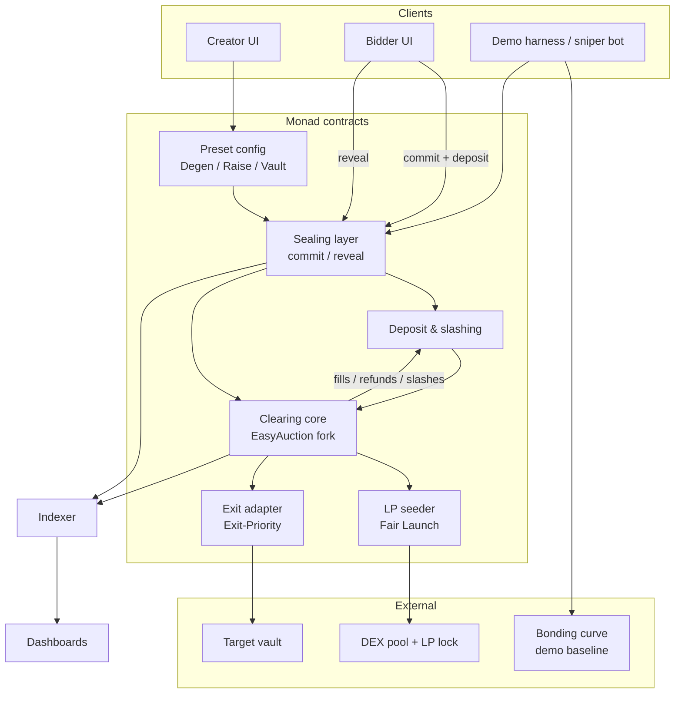

# 03 — Architecture

Components of the Sealed-Bid Auction Engine, how they connect, external services, and portability to Arbitrum.

Status: draft

## Components

| Component | Responsibility | Origin [src: Monad Sealed-Bid Auction Engine.md] |
| --- | --- | --- |
| Sealing layer | Accepts commitments `keccak256(price, quantity, salt, msg.sender)` and uniform deposits; accepts reveals; tracks who revealed | Hand-written |
| Clearing core | Ranks revealed bids by price, accumulates volume to the sell amount, sets the uniform price, handles partial fill at the marginal bid, multi-transaction settlement | Forked from Gnosis EasyAuction, read line by line |
| Deposit & slashing | Holds uniform deposits, slashes non-revealers, refunds losers and excess | Hand-written |
| LP seeder (Fair Launch only) | Takes proceeds + remaining supply, seeds a DEX pool, locks LP | Hand-written |
| Preset config | Degen / Raise / Vault parameter sets on the same contracts | Config |
| Exit adapter (Exit-Priority only) | Wraps a vault so exit slots are the auctioned asset and the clearing discount accrues to remaining holders | Hand-written (reuses clearing core unchanged) |
| Frontend | Wallet connect, creator setup, bidder commit/reveal/claim, countdown, dashboards | LLM-assisted |
| Indexer | Decodes events for dashboards and the demo | LLM-assisted |
| Demo harness | Sniper bot vs bonding curve vs auction; vault-run simulator | LLM-assisted |

The governing rule: **vibe code everything except the path between "bidder sends money" and "bidder gets tokens or a refund"** [src: Monad Sealed-Bid Auction Engine.md].

## Diagram

## Data path per round

1. Creator (or vault adapter) opens a round with preset parameters.
2. Bidders commit hash + uniform deposit during the commit window.
3. Bidders reveal during the reveal window.
4. Anyone triggers clearing; the clearing core runs the EasyAuction loop over revealed bids only.
5. Settlement pays fills, refunds losers, slashes non-revealers.
6. Fair Launch: LP seeder pools proceeds + remainder and locks LP. Exit-Priority: adapter pays exiting holders at the clearing discount and credits the remainder to stayers.

Sources for steps 2–6: [src: Monad Sealed-Bid Auction Engine.md]. Step 1 and the "anyone triggers clearing" assumption are derived from EasyAuction's permissionless `settleAuction` pattern and marked in [12-open-questions.md](12-open-questions.md).

## Inherited constraints from EasyAuction [src: Monad Sealed-Bid Auction Engine.md]

- Total bidding-token volume must stay under 2^96 or the auction becomes unsettleable.
- Prices must be representable as uint96 fractions.
- Minimum bid size is required, not optional — it is the defense against gas DoS by dust commits.
- LGPL-3.0 is copyleft; fine for a hackathon with disclosure, decide before commercializing.

## External services

| Service | Used for | Status |
| --- | --- | --- |
| Monad RPC / testnet | Deploy, transact | TODO: which RPC, testnet vs mainnet for demo |
| DEX on Monad | LP seeding | TODO: not found in source — which DEX and LP-lock contract |
| nad.fun bonding curve | Demo baseline for the sniper head-to-head [src: Monad Sealed-Bid Auction Engine.md] | TODO: use live nad.fun or a local fork |
| Target vault for Exit-Priority | One vault, one asset [src: Monad Sealed-Bid Auction Engine.md] | TODO: not found in source — which vault |
| `/agentguard scan` | Self-scan of contracts before submission [src: Monad Sealed-Bid Auction Engine.md] | Planned |

## Threat model (what the architecture defends and what it does not)

- **Adversary is the current and next few leaders**, not every bot on the network, because Monad has no global mempool: RPC nodes forward transactions to the next N leaders (N=3 today) and each validator keeps a local mempool [src: https://docs.monad.xyz/monad-arch/consensus/local-mempool] [src: Monad Sealed-Bid Auction Engine.md].
- **No encrypted mempool today.** BTX is an IACR ePrint scheme by Category Labs (Agarwal, Das, Poorebrahim Gilkalaye, Rindal, Shoup, approved 21 Apr 2026) with an implementation benchmark (~598 ms decryption at batch 512) but no deployment mention [src: https://eprint.iacr.org/2026/754]. The Cadence post describes BTX as complementary and says gains come "when fully implemented and released on Monad" [src: https://monad.xyz/blog/cadence-multiple-concurrent-proposers]. The live mempool docs do not mention encryption at all [src: https://docs.monad.xyz/monad-arch/consensus/local-mempool]. Therefore privacy is from commit-reveal alone; BTX is a future upgrade path, not a dependency [src: Monad Sealed-Bid Auction Engine.md].
- **Reveal refusal** is countered by uniform overcollateralized deposits plus slashing [src: Monad Sealed-Bid Auction Engine.md].
- **Still leaks:** commitment count and timing, the uniform escrow cap (bounds bid size), price tick granularity, and last-reveal as an attack position [src: Monad Sealed-Bid Auction Engine.md].

## Portability to Arbitrum (requested check)

Buildable: yes. Everything is Solidity plus standard EVM opcodes; EasyAuction is an Ethereum-mainnet contract and Arbitrum One is EVM-equivalent. What changes:

| Aspect | Monad | Arbitrum One | Effect on the engine |
| --- | --- | --- | --- |
| Pending-tx visibility | Local mempools, next N leaders see it [src: https://docs.monad.xyz/monad-arch/consensus/local-mempool] | Centralized sequencer with a private mempool; users are "protected from front-running and sandwich attacks" [src: https://docs.arbitrum.io/how-arbitrum-works/timeboost/gentle-introduction] | Commit phase is arguably *more* private on Arbitrum; the observer is the single sequencer operator |
| Priority | None; FIFO-ish local ordering | Timeboost express lane: winner of a 60 s sealed-bid second-price auction gets a 200 ms head start; others delayed 200 ms [src: https://docs.arbitrum.io/how-arbitrum-works/timeboost/gentle-introduction] | The "last reveal" position could be bought via the express lane; reveal-window design must not reward the final 200 ms |
| Finality | ~800 ms per PRD [src: Monad Sealed-Bid Auction Engine.md] | Soft-confirmation by sequencer; L1 finality minutes | Round cadence for Exit-Priority (every N blocks) slower in hard-finality terms |
| Incumbents | nad.fun bonding curve | Uniswap CCA + HuddlePad (transparent uniform-price launch with auto-liquidity) [src: https://www.coinrank.io/crypto/uniswap-cca-is-rewriting-arbitrum-native-token-launches/] | Fair Launch niche is occupied; sealed bids are the only differentiator |
| Fees | Sub-cent bidder journey [src: Monad Sealed-Bid Auction Engine.md] | Low but includes L1 data cost | TODO: measure commit + reveal + claim cost on Arbitrum |

Recommendation: keep Monad for the hackathon (track fit, incumbent contrast), keep the contracts chain-agnostic (no Monad precompiles), and note Arbitrum as a follow-on deployment in [11-roadmap.md](11-roadmap.md).

Related files: [01-overview.md](01-overview.md) · [04-flows.md](04-flows.md) · [05-data-model.md](05-data-model.md) · [06-api.md](06-api.md) · [07-tech-stack.md](07-tech-stack.md) · [10-decisions.md](10-decisions.md) · [12-open-questions.md](12-open-questions.md)
