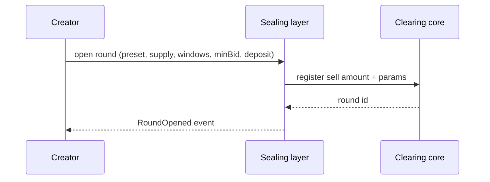
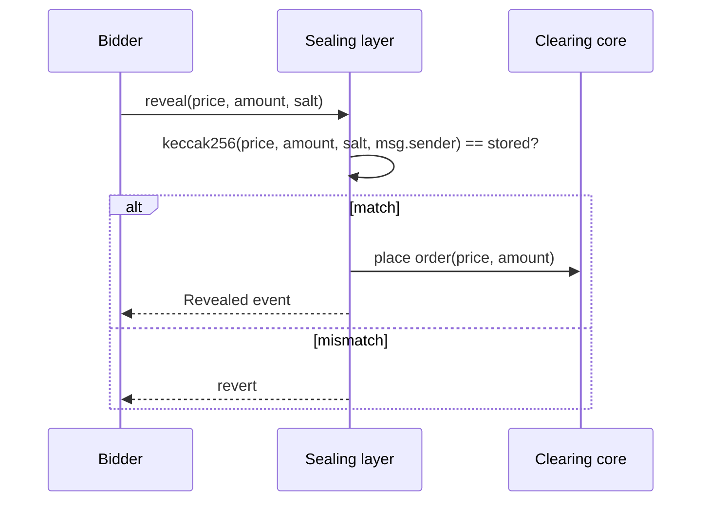
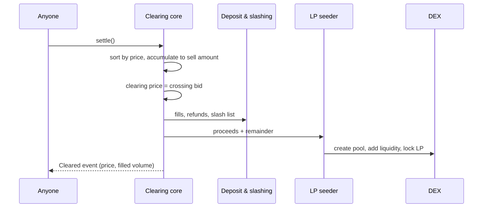
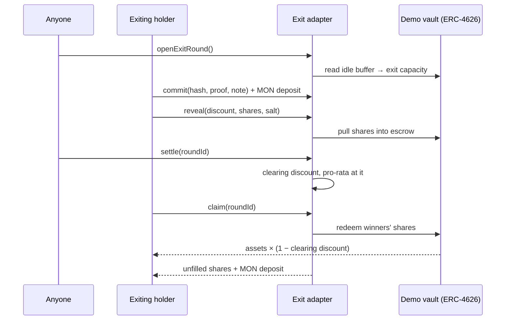
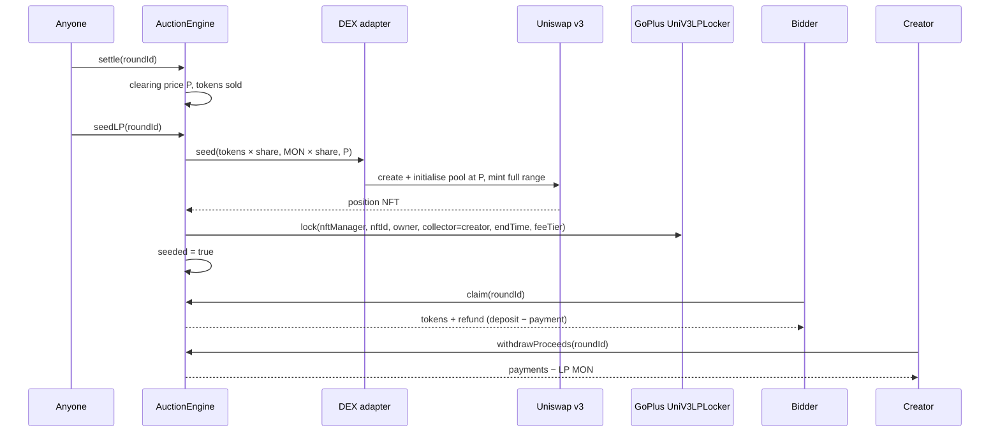

# 04 — Flows

Every user and system flow of the engine, step by step, with sequence diagrams and failure cases.

Status: draft

Terminology: **round** = one commit → reveal → clear → settle cycle. **Sealing layer**, **clearing core**, **LP seeder**, **exit adapter** as in [03-architecture.md](03-architecture.md).

## Flow 1 — Creator opens a Fair Launch

1. Creator connects a wallet and picks a preset (Degen or Raise) [src: Monad Sealed-Bid Auction Engine.md].
2. Creator locks token supply into the auction contract [src: Monad Sealed-Bid Auction Engine.md].
3. Creator sets window lengths, minimum bid size, uniform deposit amount, and (Raise) allowlist + vesting [src: Monad Sealed-Bid Auction Engine.md].
4. Contract emits the round parameters; commit window opens.



Failure cases:
- Supply not approved/transferred → open reverts.
- Minimum bid size omitted → must revert; it is the gas-DoS defense [src: Monad Sealed-Bid Auction Engine.md].
- Sell amount or price outside `uint96`, or a price off the tick grid → revert.

## Flow 2 — Bidder commits

1. Bidder picks price and amount in the UI; the UI generates a random salt.
2. UI computes `keccak256(price, amount, salt, msg.sender)` [src: Monad Sealed-Bid Auction Engine.md].
3. The UI encrypts `(price, amount, salt)` with a key derived from a wallet signature into a fixed-size `note`, saves the bid in localStorage and offers a backup file (decision 33).
4. Bidder sends `commit(hash, proof, note)` plus the uniform deposit (same capped amount for everyone, larger than any allowed bid) [src: Monad Sealed-Bid Auction Engine.md]. `proof` is the Merkle proof on allowlisted Raise rounds, empty otherwise (decision 32).
5. Sealing layer stores the hash keyed by bidder, escrows the deposit, and emits `note` in `Committed` without storing it.

```mermaid
sequenceDiagram
  participant B as Bidder
  participant UI as Bidder UI
  participant SL as Sealing layer
  participant DP as Deposit & slashing
  B->>UI: price, amount
  UI->>UI: salt = random; h = keccak256(price, amount, salt, sender)
  UI->>UI: note = encrypt(price, amount, salt; key from wallet signature)
  UI->>SL: commit(h, proof, note) + deposit
  SL->>DP: escrow deposit
  SL-->>UI: Committed event
  UI->>UI: save bid locally, offer backup file
```

Failure cases:
- Deposit ≠ uniform amount → revert (a variable deposit would leak bid size) [src: Monad Sealed-Bid Auction Engine.md].
- Commit after window close → revert.
- Bid details lost on this device → re-sign, decrypt the `note` from the `Committed` event, and check the hash against the stored commitment before revealing. If the wallet's signatures are not deterministic, the backup file is the only path, which is why it is required for such wallets (decision 33).
- Same bidder commits twice → reverts: one commitment per address per round (resolved in code, Q2).

## Flow 3 — Bidder reveals

1. Reveal window opens after the commit window closes.
2. Bidder submits price, amount, salt [src: Monad Sealed-Bid Auction Engine.md].
3. Sealing layer recomputes the hash with `msg.sender` and checks it matches the stored commitment.
4. On match, the bid is passed to the clearing core's order book; the bidder is marked revealed.



Failure cases:
- Hash mismatch → revert; commitment stays unrevealed and will be slashed at settlement.
- Reveal from a different address → cannot match because `msg.sender` is in the hash; this is what blocks replay and reveal front-running [src: Monad Sealed-Bid Auction Engine.md].
- Bid below minimum bid size → rejected at reveal; the bidder stays unrevealed and is slashable (resolved in code, Q3).
- Last revealer sees everyone else and declines → accepted leak; slashing is the deterrent [src: Monad Sealed-Bid Auction Engine.md].

## Flow 4 — Clear and settle

1. Reveal window closes; anyone calls settle.
2. The clearing core walks price levels from the highest down, adding bid amounts. The level where the total first covers the supply sets the clearing price P. Bids above P get their full amount; bids at P share what is left pro-rata; bids below P get nothing [src: https://docs.zama.org/auction/how-it-works].
3. If there are many price levels, settlement continues over multiple transactions.
4. Winners claim tokens; losers claim refunds; deposits of revealed bidders are released net of fills [src: Monad Sealed-Bid Auction Engine.md].
5. Non-revealers lose their deposit [src: Monad Sealed-Bid Auction Engine.md]: after the reveal window, one call, `burnUnrevealed(roundId)`, burns `(commits − reveals) × deposit` (decision 30).
6. Fair Launch only: LP seeder pools proceeds + remaining supply and locks LP [src: Monad Sealed-Bid Auction Engine.md]. Per decisions 23–24, it splits liquidity across the creator's chosen DEX adapters, initialises each pool at the clearing price, and locks every LP position in the GoPlus SafeToken Locker. Claims stay blocked until seeding completes (Q5).



Failure cases (the eight bugs, ranked by likelihood [src: Monad Sealed-Bid Auction Engine.md]):
1. Commit without salt → brute-forced in milliseconds.
2. Commit not bound to `msg.sender` → replay / reveal front-run.
3. Slashing accounting on non-reveal → stranded funds.
4. Off-by-one at the clearing price. The pro-rata split at the clearing price must round down (over-allocating is insolvency) and payments must round up; either one backwards strands tokens or drains MON.
5. Reentrancy on refund and claim.
6. Gas DoS via commit spam → auction permanently unsettleable.
7. Sandwichable LP seed → first swap after seeding is exposed.
8. Precision on `price × amount` favoring the bidder in aggregate.

## Flow 5 — Exit-Priority round (use case 2)

Decision 31. Same engine and clearing; only the meaning of the fields changes.

1. Anyone calls `openExitRound()` once the previous round has settled and N blocks have passed. Exit capacity is fixed now: `min(the vault's idle buffer in shares, maxExitSharesPerRound)` [src: Monad Sealed-Bid Auction Engine.md].
2. Holders who want out commit a sealed bid, `(discount in bps, shares)`, plus the uniform MON deposit. A higher discount means more willing to pay for priority [src: Monad Sealed-Bid Auction Engine.md].
3. Reveal pulls the bid's shares into the adapter. The amount is public from this point anyway; a reveal without the shares reverts, and the deposit is later burned.
4. Clear with the same rules as a launch: the discount at which bids first cover the capacity is the clearing discount; bids above it exit in full, bids at it share pro-rata, bids below it do not exit.
5. Claim: winners' shares are redeemed at `(1 − clearing discount)`; the discount stays in the vault, raising the share price for everyone who stayed [src: Monad Sealed-Bid Auction Engine.md]. Unfilled shares and the MON deposit go back to the bidder.



Failure cases:
- No bids → the round clears empty; capacity rolls into the next round.
- A reveal without enough shares → reverts; that bidder's deposit is burned (decision 30).
- The idle buffer is empty → capacity is zero and `openExitRound()` reverts rather than opening a round nobody can fill.

## Flow 6 — Demo: sniper head-to-head

1. Harness launches the same token twice: once on a bonding curve, once on the engine [src: Monad Sealed-Bid Auction Engine.md].
2. The same sniper bot attacks both.
3. On the curve, the bot takes the first blocks; on the auction it receives the clearing price like everyone else [src: Monad Sealed-Bid Auction Engine.md].
4. Two panes, twenty seconds, no narration [src: Monad Sealed-Bid Auction Engine.md].

Failure cases:
- Demo depends on live nad.fun → TODO: run against a local curve to avoid network risk.
- Auction round too long for a 20-second clip → use Degen preset with the shortest windows.

## Flow 7 — Demo: bank run not happening

1. Simulate a run on one vault, two panes [src: Monad Sealed-Bid Auction Engine.md].
2. FIFO pane: queue lengthens, token depegs, cascade, latecomers get nothing.
3. Auction pane: clears at a widening discount, stays orderly, discount accrues to stayers.

## Flow 8 — Seed and lock the LP (Fair Launch)

The fixed design (decisions 25, 27, 28). It solves two problems: the pool needs all proceeds at once, and a fixed token/MON pair never matches the clearing price exactly.

1. **At `openRound`** the creator commits, immutably: `lpShareBps`, the DEX split `[(adapter, bps)]`, the lock terms (permanent, or an unlock date) and the GoPlus fee tier. The creator deposits `sellAmount` tokens for the auction plus a worst-case LP reserve of `sellAmount × lpShareBps / 10000`.
2. **`settle`** fixes the clearing price P and the tokens sold.
3. **`seedLP(roundId)`**, callable by anyone once settled:
   - LP tokens = sold × `lpShareBps`. LP MON = sold × P × `lpShareBps`. Because both come from the same sold amount at price P, they are already in ratio P: nothing is left over except rounding dust.
   - The MON comes from the round's deposits, which already sit in the engine. No bidder has claimed yet, so the whole amount is available at once.
   - For each DEX in the split: initialise the pool at P (or revert if a pool already exists at a deviating price), mint a full-range position, then lock the position NFT in the GoPlus `UniV3LPLocker` with the engine or creator as `owner` and the creator as `collector`.
4. **`claim`** opens only after seeding. Each winner receives tokens and a refund of `deposit − payment`. Payments accrue to the round.
5. **Creator withdraws** the payments that did not go into the LP: total collected − LP MON.
6. **Leftovers** — unsold supply and the unused LP reserve, when undersubscribed — follow the Q16 decision.



Failure cases:
- A pool already exists at a price far from P → `seedLP` reverts. The creator can choose a different fee tier, which is a different pool.
- The locker rejects the lock → `seedLP` reverts as a whole. No half-seeded state: claims stay closed.
- Nobody calls `seedLP` → claims stay closed. Anyone can call it, and the frontend calls it automatically after settlement.


Related files: [01-overview.md](01-overview.md) · [03-architecture.md](03-architecture.md) · [05-data-model.md](05-data-model.md) · [06-api.md](06-api.md) · [08-ui-notes.md](08-ui-notes.md) · [12-open-questions.md](12-open-questions.md)
