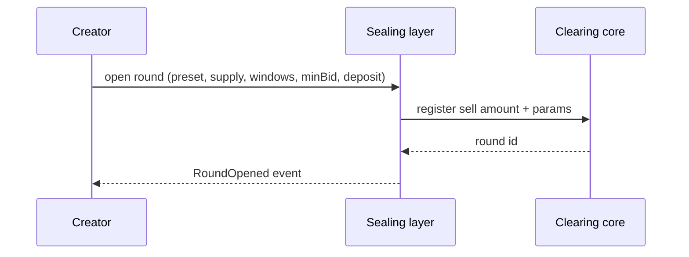
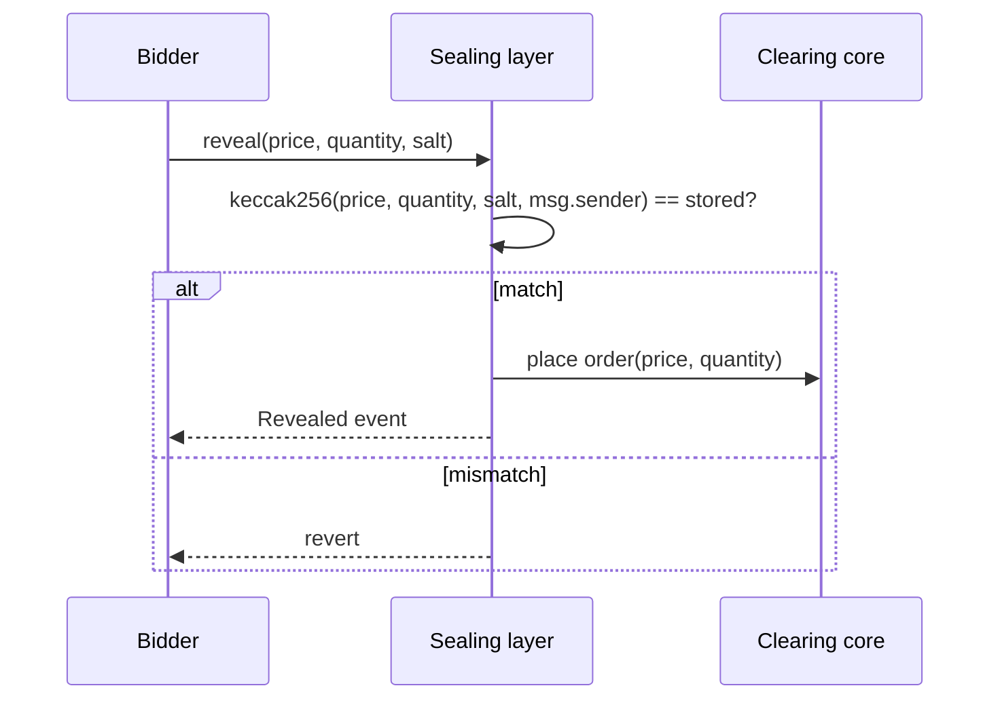
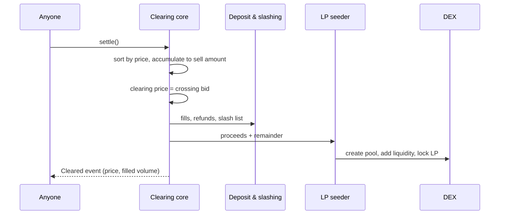
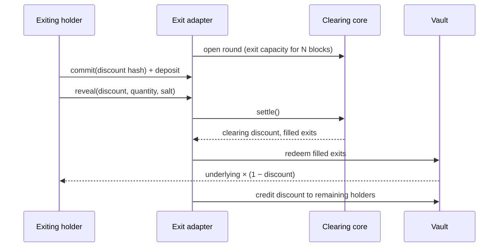

# 04 — Flows

Every user and system flow of the engine, step by step, with sequence diagrams and failure cases.

Status: draft

Terminology: **round** = one commit → reveal → clear → settle cycle. **Sealing layer**, **clearing core**, **LP seeder**, **exit adapter** as in [03-architecture.md](03-architecture.md).

## Flow 1 — Creator opens a Fair Launch

1. Creator connects a wallet and picks a preset (Degen or Raise) [src: Monad Sealed-Bid Auction Engine.md].
2. Creator locks token supply into the auction contract [src: Monad Sealed-Bid Auction Engine.md].
3. Creator sets window lengths, minimum bid size, uniform deposit amount, and (Raise) allowlist + vesting [src: Monad Sealed-Bid Auction Engine.md].
4. Contract emits the round parameters; commit window opens.



Failure cases:
- Supply not approved/transferred → open reverts.
- Minimum bid size omitted → must revert; it is the gas-DoS defense [src: Monad Sealed-Bid Auction Engine.md].
- Sell amount or price outside uint96 → revert per EasyAuction constraints [src: Monad Sealed-Bid Auction Engine.md].

## Flow 2 — Bidder commits

1. Bidder picks price and quantity in the UI; UI generates a random salt and stores it locally.
2. UI computes `keccak256(price, quantity, salt, msg.sender)` [src: Monad Sealed-Bid Auction Engine.md].
3. Bidder sends the commitment plus the uniform deposit (same capped amount for everyone, larger than any allowed bid) [src: Monad Sealed-Bid Auction Engine.md].
4. Sealing layer stores the hash keyed by bidder; deposit is escrowed.

```mermaid
sequenceDiagram
  participant B as Bidder
  participant UI as Bidder UI
  participant SL as Sealing layer
  participant DP as Deposit & slashing
  B->>UI: price, quantity
  UI->>UI: salt = random; h = keccak256(price, quantity, salt, sender)
  UI->>SL: commit(h) + deposit
  SL->>DP: escrow deposit
  SL-->>UI: Committed event
  UI->>UI: persist salt locally
```

Failure cases:
- Deposit ≠ uniform amount → revert (a variable deposit would leak bid size) [src: Monad Sealed-Bid Auction Engine.md].
- Commit after window close → revert.
- Salt lost client-side → bidder cannot reveal and is slashed. TODO: decide on salt backup UX (see [08-ui-notes.md](08-ui-notes.md)).
- Same bidder commits twice → TODO: allow multiple commitments per address or one only (not found in source).

## Flow 3 — Bidder reveals

1. Reveal window opens after the commit window closes.
2. Bidder submits price, quantity, salt [src: Monad Sealed-Bid Auction Engine.md].
3. Sealing layer recomputes the hash with `msg.sender` and checks it matches the stored commitment.
4. On match, the bid is passed to the clearing core's order book; the bidder is marked revealed.



Failure cases:
- Hash mismatch → revert; commitment stays unrevealed and will be slashed at settlement.
- Reveal from a different address → cannot match because `msg.sender` is in the hash; this is what blocks replay and reveal front-running [src: Monad Sealed-Bid Auction Engine.md].
- Bid below minimum bid size → TODO: reject at reveal or at commit (cannot check at commit since price is hidden).
- Last revealer sees everyone else and declines → accepted leak; slashing is the deterrent [src: Monad Sealed-Bid Auction Engine.md].

## Flow 4 — Clear and settle

1. Reveal window closes; anyone calls settle.
2. Clearing core sorts revealed bids by price, accumulates volume until the sell amount is reached; the crossing bid sets the uniform price; that bid may be partially filled [src: Monad Sealed-Bid Auction Engine.md].
3. If the loop runs long, settlement continues over multiple transactions (EasyAuction behavior) [src: Monad Sealed-Bid Auction Engine.md].
4. Winners claim tokens; losers claim refunds; deposits of revealed bidders are released net of fills [src: Monad Sealed-Bid Auction Engine.md].
5. Non-revealers are slashed [src: Monad Sealed-Bid Auction Engine.md]. TODO: where the slashed amount goes (creator, stayers, burn) — not found in source.
6. Fair Launch only: LP seeder pools proceeds + remaining supply and locks LP [src: Monad Sealed-Bid Auction Engine.md].



Failure cases (the eight bugs, ranked by likelihood [src: Monad Sealed-Bid Auction Engine.md]):
1. Commit without salt → brute-forced in milliseconds.
2. Commit not bound to `msg.sender` → replay / reveal front-run.
3. Slashing accounting on non-reveal → stranded funds.
4. Off-by-one at the marginal bid → over-allocate (insolvent) or under-allocate (tokens stuck).
5. Reentrancy on refund and claim.
6. Gas DoS via commit spam → auction permanently unsettleable.
7. Sandwichable LP seed → first swap after seeding is exposed.
8. Precision on `price × quantity` favoring the bidder in aggregate.

## Flow 5 — Exit-Priority round (use case 2)

1. Every N blocks the exit adapter opens a round; the asset auctioned is exit capacity for the period [src: Monad Sealed-Bid Auction Engine.md].
2. Holders who want liquidity now commit sealed bids on the discount they will accept [src: Monad Sealed-Bid Auction Engine.md].
3. Reveal, then clear: all clearing exits pay the same discount [src: Monad Sealed-Bid Auction Engine.md].
4. Exiting holders receive underlying at the clearing discount; the discount recapitalizes holders who stay [src: Monad Sealed-Bid Auction Engine.md].



Failure cases:
- No bids in a round → round clears empty; stayers unaffected.
- Exit capacity mis-set → TODO: who sets N and capacity (not found in source).
- Vault integration surface unknown → TODO: target vault not named in source.

## Flow 6 — Demo: sniper head-to-head

1. Harness launches the same token twice: once on a bonding curve, once on the engine [src: Monad Sealed-Bid Auction Engine.md].
2. The same sniper bot attacks both.
3. On the curve, the bot takes the first blocks; on the auction it receives the clearing price like everyone else [src: Monad Sealed-Bid Auction Engine.md].
4. Two panes, twenty seconds, no narration [src: Monad Sealed-Bid Auction Engine.md].

Failure cases:
- Demo depends on live nad.fun → TODO: run against a local curve to avoid network risk.
- Auction round too long for a 20-second clip → use Degen preset with the shortest windows.

## Flow 7 — Demo: bank run not happening

1. Simulate a run on one vault, two panes [src: Monad Sealed-Bid Auction Engine.md].
2. FIFO pane: queue lengthens, token depegs, cascade, latecomers get nothing.
3. Auction pane: clears at a widening discount, stays orderly, discount accrues to stayers.

Related files: [01-overview.md](01-overview.md) · [03-architecture.md](03-architecture.md) · [05-data-model.md](05-data-model.md) · [06-api.md](06-api.md) · [08-ui-notes.md](08-ui-notes.md) · [12-open-questions.md](12-open-questions.md)
