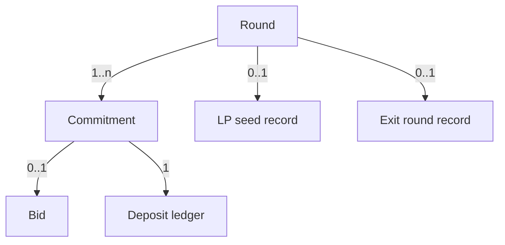

# 05 — Data Model

Entities the engine stores onchain and what the indexer derives, with fields and relations.

Status: draft

No contract code exists yet; every entity below is derived from the PRD's mechanism description [src: Monad Sealed-Bid Auction Engine.md] and EasyAuction's order model [src: https://github.com/Gnosis-Auction/auction-contracts]. Field names are proposals — TODO: align with code once written.

## Round (Auction)

| Field | Type | Description |
| --- | --- | --- |
| roundId | uint256 | Identifier |
| preset | enum {Degen, Raise, Vault} | Parameter set [src: Monad Sealed-Bid Auction Engine.md] |
| auctioningToken | address | Token being sold (Fair Launch) or exit capacity marker (Exit-Priority) |
| biddingToken | address | Token bids are paid in (e.g. MON or a stable) |
| sellAmount | uint96 | Supply locked; must be < 2^96 per EasyAuction [src: Monad Sealed-Bid Auction Engine.md] |
| minBidSize | uint96 | Required anti-spam floor [src: Monad Sealed-Bid Auction Engine.md] |
| depositAmount | uint256 | Uniform collateral each bidder locks; larger than the max allowed bid [src: Monad Sealed-Bid Auction Engine.md] |
| commitEnd | uint64 | Timestamp/block the commit window closes |
| revealEnd | uint64 | Timestamp/block the reveal window closes |
| allowlistRoot | bytes32 | Raise preset only; zero otherwise [src: Monad Sealed-Bid Auction Engine.md] |
| vesting | struct | Raise preset only [src: Monad Sealed-Bid Auction Engine.md]; TODO: schedule shape not found in source |
| autoLP | bool | Seed DEX pool on settle (Degen yes, Raise optional, Vault no) [src: Monad Sealed-Bid Auction Engine.md] |
| clearingPrice | uint96 num / uint96 den | Set at settle; uint96 fraction per EasyAuction [src: Monad Sealed-Bid Auction Engine.md] |
| status | enum {Open, Revealing, Settling, Settled} | Settling exists because settlement can span multiple transactions [src: Monad Sealed-Bid Auction Engine.md] |

## Commitment

| Field | Type | Description |
| --- | --- | --- |
| roundId | uint256 | FK → Round |
| bidder | address | `msg.sender` at commit; part of the hash preimage [src: Monad Sealed-Bid Auction Engine.md] |
| hash | bytes32 | `keccak256(price, quantity, salt, msg.sender)` [src: Monad Sealed-Bid Auction Engine.md] |
| depositLocked | uint256 | Equals Round.depositAmount |
| committedAt | uint64 | Block; leaks timing by design [src: Monad Sealed-Bid Auction Engine.md] |
| revealed | bool | Set on successful reveal |

TODO: one commitment per address per round, or many — not found in source.

## Bid (revealed order)

| Field | Type | Description |
| --- | --- | --- |
| roundId | uint256 | FK → Round |
| bidder | address | FK → Commitment |
| price | uint96 | Limit price as uint96 fraction [src: Monad Sealed-Bid Auction Engine.md] |
| quantity | uint96 | Bidding-token amount; ≥ minBidSize |
| salt | bytes32 | Only needed at reveal; not stored after verification |
| filled | uint96 | Amount filled at settle (partial at the marginal bid) [src: Monad Sealed-Bid Auction Engine.md] |

For Exit-Priority, `price` is interpreted as the accepted discount and `quantity` as the amount of vault shares to exit [src: Monad Sealed-Bid Auction Engine.md].

## Deposit ledger

| Field | Type | Description |
| --- | --- | --- |
| roundId, bidder | — | Composite key |
| locked | uint256 | Uniform amount |
| appliedToFill | uint256 | Portion consumed by the fill at clearing price |
| refunded | uint256 | Returned to bidder |
| slashed | uint256 | Taken on non-reveal [src: Monad Sealed-Bid Auction Engine.md] |

Invariant: `locked == appliedToFill + refunded + slashed` after settlement. Bug #3 in the PRD is exactly a violation of this [src: Monad Sealed-Bid Auction Engine.md].

## LP seed record (Fair Launch)

| Field | Type | Description |
| --- | --- | --- |
| roundId | uint256 | FK → Round |
| pool | address | DEX pool created |
| tokenAmount | uint256 | Remaining supply added |
| proceedsAmount | uint256 | Bidding-token proceeds added |
| lpLockedUntil | uint64 | Lock expiry [src: Monad Sealed-Bid Auction Engine.md]; TODO: duration not found in source |

## Exit round record (Exit-Priority)

| Field | Type | Description |
| --- | --- | --- |
| roundId | uint256 | FK → Round |
| vault | address | Target vault; TODO: not named in source |
| exitCapacity | uint256 | Shares redeemable this round |
| clearingDiscount | uint96 fraction | Uniform discount paid by all exits |
| accruedToStayers | uint256 | Discount amount credited to remaining holders [src: Monad Sealed-Bid Auction Engine.md] |

## Relations

## Indexer-derived views (offchain)

- Demand curve after reveal (for dashboards).
- Commitment count over time (this is the intentional leak; show it, do not hide it) [src: Monad Sealed-Bid Auction Engine.md].
- Per-bidder journey cost (commit + reveal + claim) to prove the < $0.01 goal [src: Monad Sealed-Bid Auction Engine.md].

Related files: [03-architecture.md](03-architecture.md) · [04-flows.md](04-flows.md) · [06-api.md](06-api.md) · [12-open-questions.md](12-open-questions.md)
