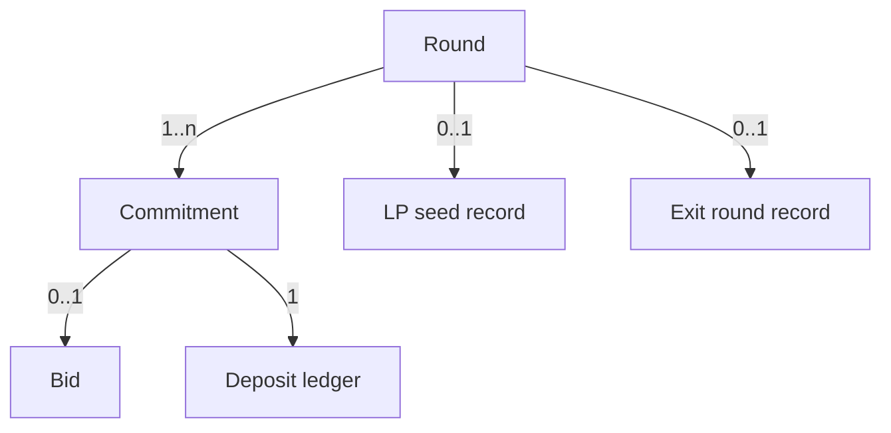

# 05 — Data Model

Entities the engine stores onchain and what the indexer derives, with fields and relations.

Status: draft

Fields below match `AuctionEngine.Round`, `Bid`, `Vest` and the ledger structs in `contracts/src` (23 Sep); `getRound(roundId)` returns the whole round. Exit-Priority fields describe `ExitAuction`, which is in progress.

## Round (Auction)

| Field | Type | Description |
| --- | --- | --- |
| roundId | uint256 | Identifier |
| preset | enum {Degen, Raise, Vault} | Parameter set [src: Monad Sealed-Bid Auction Engine.md] |
| auctioningToken | address | Token being sold (Fair Launch) or exit capacity marker (Exit-Priority) |
| biddingToken | address | Token bids are paid in (e.g. MON or a stable) |
| sellAmount | uint96 | Supply offered in the auction |
| minBidSize | uint96 | Required anti-spam floor [src: Monad Sealed-Bid Auction Engine.md] |
| depositAmount | uint256 | Uniform collateral each bidder locks; larger than the max allowed bid [src: Monad Sealed-Bid Auction Engine.md] |
| commitEnd | uint64 | Timestamp/block the commit window closes |
| revealEnd | uint64 | Timestamp/block the reveal window closes |
| allowlistRoot | bytes32 | OpenZeppelin `StandardMerkleTree` root; zero = open round (decision 32) |
| tgeBps / cliff / vestDuration | uint16 / uint64 / uint64 | Raise only: share paid at claim, then linear after the cliff, counted from settlement (decision 32) |
| autoLP | bool | Seed DEX pool on settle (Degen yes, Raise optional, Vault no) [src: Monad Sealed-Bid Auction Engine.md] |
| tickSize | uint96 | Prices must be multiples of this (decision 22) |
| reservePrice | uint96 | Lowest acceptable price per token, per round (AUDIT M4) |
| lpShareBps | uint16 | Share of MON raised and tokens sold that goes to the LP (decision 25) |
| dexSplits | (address adapter, uint16 bps)[] | Creator-chosen venues; bps sum to 10000 (decision 26) |
| lockOwner / lockEnd / lockFeeTier | address / uint64 / string | GoPlus lock terms; Degen: owner is the engine, permanent (decision 28) |
| tokenReserve | uint256 | Worst-case LP token reserve deposited at open: `sellAmount × lpShareBps / 10000` |
| clearingPrice | uint96 | P: MON wei per 1e18 token units; the lowest price at which a bid fills (decision 22) |
| qtyAbove / qtyAtPrice / countAtPrice | uint256 | Set at settle; drive the pro-rata fill at P |
| seeded | bool | Claims open only after the LP is seeded (decision 27) |
| status | enum {Open, Revealing, Settling, Settled} | Settling exists because settlement can span multiple transactions [src: Monad Sealed-Bid Auction Engine.md] |

## Commitment

| Field | Type | Description |
| --- | --- | --- |
| roundId | uint256 | FK → Round |
| bidder | address | `msg.sender` at commit; part of the hash preimage [src: Monad Sealed-Bid Auction Engine.md] |
| hash | bytes32 | `keccak256(price, amount, salt, msg.sender)` [src: Monad Sealed-Bid Auction Engine.md] |
| depositLocked | uint256 | Equals Round.depositAmount |
| committedAt | uint64 | Block; leaks timing by design [src: Monad Sealed-Bid Auction Engine.md] |
| revealed | bool | Set on successful reveal |
| note | bytes | Encrypted bid backup; emitted in `Committed`, **never stored** (decision 33) |

TODO: one commitment per address per round, or many — not found in source.

## Bid (revealed order)

| Field | Type | Description |
| --- | --- | --- |
| roundId | uint256 | FK → Round |
| bidder | address | FK → Commitment |
| price | uint96 | Max price per whole token, in wei of MON per 1e18 token units [src: user decision, 22 Sep] |
| amount | uint96 | Token units wanted. Winners above P get all of it; bids at P share what is left pro-rata (decision 22) |
| maxSpend | uint96 | `ceil(price × amount / 1e18)`. Must be ≥ minBidSize and < the uniform deposit |
| allocated | uint96 | Set at claim: full `amount` above P, `floor(amount × (supply − qtyAbove) / qtyAtPrice)` at P, 0 below |
| paid | uint96 | `ceil(allocated × P / 1e18)`; never exceeds `maxSpend`. Refund = deposit − paid |
| salt | bytes32 | Only needed at reveal; not stored after verification |

For Exit-Priority, `price` is interpreted as the accepted discount and `amount` as the amount of vault shares to exit [src: Monad Sealed-Bid Auction Engine.md].

## Deposit ledger

| Field | Type | Description |
| --- | --- | --- |
| roundId, bidder | — | Composite key |
| locked | uint256 | Uniform amount |
| appliedToFill | uint256 | Portion consumed by the fill at clearing price |
| refunded | uint256 | Returned to bidder |
| burned | uint256 | The whole deposit, on non-reveal (decision 30) |

Invariant: `locked == appliedToFill + refunded + burned` after settlement, where `appliedToFill` is what the bidder paid. Bug #3 is exactly a violation of this.

## LP seed record (Fair Launch)

| Field | Type | Description |
| --- | --- | --- |
| roundId | uint256 | FK → Round |
| adapter | address | DEX adapter used (Uniswap v3, PancakeSwap v3, …) — one record per venue when liquidity is split |
| pool | address | DEX pool created |
| lpRef | uint256 | LP position NFT id (v3/v4) or 0 for an ERC-20 LP token |
| lockId | uint256 | GoPlus `UniV3LPLocker` lock id [src: https://docs.gopluslabs.io/page/goplus-safetoken-locker] |
| tokenAmount | uint256 | Remaining supply added |
| proceedsAmount | uint256 | Bidding-token proceeds added |
| lpLockedUntil | uint64 | Lock expiry [src: Monad Sealed-Bid Auction Engine.md]; TODO: duration still open (Q4) |

## Exit round record (Exit-Priority)

| Field | Type | Description |
| --- | --- | --- |
| roundId | uint256 | FK → Round |
| vault | address | Our demo ERC-4626 over WMON (decision 31) |
| exitCapacity | uint256 | `min(idle buffer in shares, maxExitSharesPerRound)`, fixed at open |
| clearingDiscount | uint96 | Clearing price of the exit round, in bps |
| accruedToStayers | uint256 | Discount amount credited to remaining holders [src: Monad Sealed-Bid Auction Engine.md] |

## Relations

## Indexer-derived views (offchain)

- Demand curve after reveal (for dashboards).
- Commitment count over time (this is the intentional leak; show it, do not hide it) [src: Monad Sealed-Bid Auction Engine.md].
- Per-bidder journey cost (commit + reveal + claim) to prove the < $0.01 goal [src: Monad Sealed-Bid Auction Engine.md].

Related files: [03-architecture.md](03-architecture.md) · [04-flows.md](04-flows.md) · [06-api.md](06-api.md) · [12-open-questions.md](12-open-questions.md)
