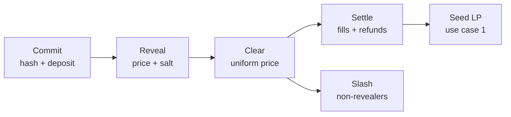

# Monad Sealed-Bid Auction Engine

2026-09-22 · @Someone

Product requirements for Monad Metropolis (submission 13 Oct 2026).

## Decision summary

One auction engine, two front doors, two tracks. We build a sealed-bid uniform-price batch auction on Monad and ship it as two configured products rather than two codebases.

| Item | Decision |
| --- | --- |
| Core | Sealed-bid, uniform clearing price, commit-reveal, overcollateralized deposits |
| Use case 1 | Memecoin fair launch — **Social, Attention & Culture** track (primary) |
| Use case 2 | Vault exit-priority auction — **Onchain Finance & Trading** track (conditional) |
| ICO / raise | A preset inside use case 1, not a standalone submission |
| Clearing math | Fork [EasyAuction](https://github.com/Gnosis-Auction/auction-contracts) (LGPL-3.0, audited by Adam Kolar, G0 Group, Feb–Mar 2021) |
| Hand-written | Commit-reveal layer, deposit slashing, LP auto-seed |

Why the memecoin launch leads: Monad's identity is parallel-EVM finance, so every strong DeFi team files into the Finance track. A rigorous auction mechanism is a technical-execution outlier in the culture track, and the head-to-head sniper demo reads to any judge. Judging is on innovation, technical execution, and track fit — we are strongest on the first two relative to that field, and the third is a write-up problem.

Use case 2 ships only if Metropolis permits multiple submissions and use case 1 is complete by day 14. Otherwise it appears as a second preset inside one submission, which proves the engine is a primitive rather than a one-off.

## Problem

First-come-first-served allocation turns scarce access into a latency race, and in both target markets the race destroys value rather than merely redistributing it.

**Token launches.** Bonding-curve launchpads price by arrival order, so the structure inherently disadvantages later buyers while sniper bots front-run ordinary participants. On [nad.fun](https://nad-fun.gitbook.io/nad.fun), Monad's dominant launchpad, a token graduates at roughly 225,000 MON with about 80% of supply sold — all of it allocated by who transacted first. The community that generates a launch's value systematically buys its top.

Existing alternatives each fail differently: fixed-price sales misprice, Dutch auctions reward low-latency professionals, and one-shot sealed auctions enable last-minute sniping. Creators must also hand-assemble sale → price discovery → LP seeding → locks, and each seam is a rug vector.

**Vault redemptions.** Every redemption queue in DeFi is FIFO or cooldown-gated. Ethereum's exit queue is strict first-in-first-out with no priority regardless of stake size; protocols like mETH bolt on two-speed systems (instant buffer for small exits, queue for large); the only priority mechanisms that exist are compliance-driven under ERC-3643, not market-driven.

Under FIFO, being early is strictly better than being late for everyone, always. That is the coordination failure that *causes* runs, not a side effect of them. It compounds: as queue waits lengthen, market makers price holding cost into their bids, the LST deviates from peg, and the deviation triggers forced liquidations. The queue manufactures the crisis it exists to contain.

**Why Monad, and why now.** Monad passed $1.4B TVL with 150+ apps and millions of daily transactions by late July 2026, and Aave's Monad market became its third-largest fee generator in 46 days (17 Sep 2026). Sub-second finality (\~800ms, 500ms blocks) makes a two-transaction commit-reveal flow cost pennies where it would be economically absurd on Ethereum L1, and makes clearing every few seconds viable where queues today impose 24–72 hour cooldowns.

## Goals and non-goals

**Goals**

- **Blind bidding.** No bidder sees another's price before clearing.
- **Uniform clearing price.** Everyone who clears in a window pays the same price.
- **Snipe resistance.** Submission timing no longer determines price. (Stated this way deliberately — see Threat model.)
- **One-click flow.** Auction → distribution → liquid pool with locked LP, atomically.
- **Cheap.** Full bidder journey (commit + reveal + claim) under $0.01 in network fees.
- **One engine.** Both use cases run the same clearing core with different parameters.

**Non-goals for the hackathon build**

- No KYC, identity, RWA, or credit scoring.
- No perpetual privacy of losing bids. Post-clear transparency is intentional.
- No FHE, no MPC network, no enclave, no ZK circuit.
- No cross-chain. Monad only.
- **No encrypted mempool.** The original PRD listed this as a privacy dependency. It does not exist on Monad and cannot be called from a contract in October — corrected in Threat model below. Privacy comes from commit-reveal alone.

## Auction mechanism

Three phases per auction round. The clearing math is forked; the sealing layer and the deposit economics are ours.

**Commit.** A bidder posts `keccak256(price, quantity, salt, msg.sender)` plus a uniform collateral deposit. All four inputs are load-bearing: without the salt a memecoin bid price has few enough plausible values to brute-force every commitment in milliseconds; without `msg.sender` a commitment can be replayed or its reveal front-run.

**Uniform deposits, not per-bid collateral.** Every bidder locks the same capped amount, larger than their bid. This is the [a16z OverCollateralizedAuction](https://a16zcrypto.com/posts/article/hidden-in-plain-sight-a-sneaky-solidity-implementation-of-a-sealed-bid-auction) pattern: if collateral scaled with the bid, the deposit itself would leak the bid. a16z names the cost honestly — more capital locked for more privacy — and we accept it, because the alternative (CREATE2 vaults plus state proofs) is not a three-week build.

**Reveal.** The bidder opens their commitment. Non-revealers are slashed, which is what makes reveal-refusal unprofitable rather than free.

**Clear.** Bids rank by price, volumes accumulate until the sell amount is reached, and the bid crossing that threshold sets the uniform price. Bids at or above clear; the rest are refunded. This is EasyAuction's logic unchanged, including partial fill at the marginal bid, configurable minimum bid size, and multi-transaction settlement when the loop runs long.

### Inherited constraints from EasyAuction

- Total bidding-token volume must stay under 2^96 (\~79B DAI) or the auction becomes unsettleable.
- Prices must be representable as uint96 fractions.
- Minimum bid size is a required anti-spam parameter, not optional — see the gas DoS entry in Build plan.
- LGPL-3.0 is copyleft. Fine for a hackathon with disclosure; worth a decision before any commercialization.

## Use case 1 — Memecoin fair launch

**Track: Social, Attention & Culture. Primary submission.**

A creator locks supply into a sealed-bid auction. Bidders commit blind, everything clears at one price, and proceeds plus remaining supply auto-seed a DEX pool with locked LP. No sniping advantage, no insider price, no hand-assembled launch pipeline.

### Presets

| Preset | Window | Allowlist | Vesting | Auto-LP |
| --- | --- | --- | --- | --- |
| Degen | Short (minutes) | No | No | Yes |
| Raise (ICO) | Long (hours–days) | Yes | Yes | Optional |
| Vault | Per round | Configurable | N/A | No |

The raise preset is where the ICO idea lives. It is the same contract with different parameters — EasyAuction was built for IDOs — so it costs near-zero marginal work. It is not a separate submission: "ICO platform" reads as 2017 to a judging panel and has no distinct audience.

### Positioning

Lead with the community, not the clearing price. Not *"uniform-price sealed-bid batch auction with commit-reveal"* but *"your community shouldn't lose its own launch to three bots in the first block — everyone pays the same price, nobody gets a head start."* The mechanism is the proof, not the pitch. Keep every technical claim in the write-up for judges who want it.

### Demo

Same sniper bot, two launches side by side. On the bonding curve it takes the first blocks. On the auction it gets the clearing price like everyone else. Twenty seconds, no narration needed.

This matters more than the contract quality for this track: culture judges will not read the clearing loop, but the head-to-head is legible to anyone in the room.

### Known risk

Memecoin buying is impulse and FOMO; our flow is commit → wait → reveal → wait → clear, two transactions with a mandatory gap, against nad.fun's one click. LBPs are the cautionary precedent — Balancer and Fjord ran provably fairer launches for years without displacing the simple curve, because users will not wait or learn a second mental model. This does not threaten the hackathon result, where judging is on innovation and execution, but expect the question and have the answer ready.

## Use case 2 — Vault exit-priority auction

**Track: Onchain Finance & Trading. Conditional second submission.**

Instead of a FIFO redemption queue, auction exit slots. Every N blocks, holders who want liquidity now submit sealed bids on the discount they will accept. All clearing exits pay the same discount, and that discount recapitalizes the holders who stay.

The race becomes a price. The holders who create liquidity demand pay for it, rather than externalizing the cost onto whoever was slower.

### Why this one and not liquidations

Liquidation auctions and intent/solver auctions are the first two things any competent DeFi team derives from "we have a sealed-bid batch auction." In a six-week, $250k hackathon both get built several times, and we would compete on polish against teams who started 1 Sep.

The filter that matters: *where does first-come-first-served allocate something scarce, and where is that race destructive rather than merely wasteful?* Liquidations fail it — the race is wasteful but the system survives. Redemption queues pass it, because FIFO is the mechanism that causes runs.

Also relevant: Chainlink SVR and UMA's Oval already attack liquidation value at the oracle layer (SVR recaptured \~$16M on $675M of Aave liquidations across \~3,900 events in nine months to early Feb 2026). Exit priority has no incumbent at all.

### Demo

Simulate a run on a vault, two panes. Under FIFO: the queue lengthens, the token depegs, the cascade starts, latecomers get nothing. Under the auction: it clears at a widening discount, stays orderly, and the discount visibly accrues to remaining holders.

We are demoing a bank run *not happening*. No other project in that track will have a demo that emotionally legible.

### Alternate variant — curator auctions

If exit-priority proves too heavy, the fallback is auctioning vault curator mandates: curators bid the fee they will accept plus a risk mandate, uniform clearing, periodic re-auction so underperformers get outbid. This converts a governance decision into a market.

Monad published ["Vaults, Curators, and the Infrastructure Behind Fintech Earn Programs"](https://www.monad.xyz/announcements) on 10 Aug 2026, and Morpho's curator model is live to integrate against — so it fits what Monad is currently promoting about itself. Weaker demo, stronger narrative fit. Exit-priority is the better project; curator is the safer one.

### Scope

One vault, one asset, an exit auction contract, a simulated run harness, two dashboards. Smaller than use case 1 because there is no LP-seeding pipeline. Reuses the clearing loop unchanged.

## Threat model and honest limits

State these before a judge finds them. Precision here is worth more than a clean claim, and a Category Labs judge will know the details.

### There is no encrypted mempool on Monad

[BTX](https://eprint.iacr.org/2026/754) (IACR ePrint 2026/754, 17 Apr 2026 — Agarwal, Das, Poorebrahim Gilkalaye, Rindal, Shoup) is a batch threshold encryption *scheme*. Category Labs describes it as "our design for encrypted mempools" and "a step towards" protocol-level MEV mitigation, and Monad's own announcement says a working encrypted mempool "**would** keep transactions hidden." Future tense throughout.

Monad's [live mempool docs](https://docs.monad.xyz/monad-arch/consensus/local-mempool) describe plaintext propagation: RPC nodes forward transactions to upcoming leaders, and validators check sender balance and nonce — which requires reading the transaction. It cannot be called from a contract in October.

**Use this as positioning, not as a dependency.** Suggested framing for the submission:

> Protocol-level encrypted mempools are coming to Monad — Category Labs published BTX in April. Until they ship, sealed-bid clearing has to live at the application layer. That's what we built. When BTX lands, our commit-reveal collapses into a single transaction and the auction gets strictly better.

### The actual threat model is narrower than usual

Monad has no global mempool at all — each validator keeps a local one. So the adversary is **the current and next few leaders**, not every bot on the network. Narrower than the Ethereum case, still worth defending, and more credible than overclaiming.

### Reveal refusal

Losing bidders have no incentive to reveal, and a bidder watching the clearing price form can strategically decline. a16z generalizes this as speculative MEV in [On the limits of encrypted mempools](https://a16zcrypto.com/posts/article/limits-encrypted-mempools), noting that penalties for failing to decrypt are "tricky to implement." Our uniform overcollateralized deposit is the answer: slashing makes refusal costly, and uniformity stops the deposit from leaking bid size.

### What the commit phase still leaks

- **Commitment count and timing.** For a memecoin launch this is close to the only question anyone is asking — how much demand is there.
- **Escrow is a uniform cap**, so bid size is bounded but capital is idle.
- **Prices are in ticks**, so granularity is public.
- **Last-reveal is an attack position.** The final revealer has seen everyone else and can decline.

### Claims to avoid

| Do not say | Say instead |
| --- | --- |
| No sniping | Snipe-resistant: submission timing no longer determines price |
| Privacy via encrypted mempool | Privacy via commit-reveal; Monad's local mempool narrows the observer set |
| Losing bids never revealed | Post-clear transparency is intentional; losers who never reveal stay private |

## Architecture and build plan

The governing rule: **vibe code everything except the path between "bidder sends money" and "bidder gets tokens or a refund."**

LLM assistance multiplies throughput 3–5x on frontend, indexer, demo harness and docs. On money-handling contracts it multiplies by roughly 1x, and less than 1x once review time is counted. The bottleneck was never typing.

| Vibe code freely | Hand-write and review line by line |
| --- | --- |
| Frontend, wallet connection, dashboard | Commit hash construction |
| Countdown UI, indexer, event decoding | Clearing loop (forked, then read) |
| Bot-vs-auction demo harness | Settlement accounting |
| Deploy scripts, test fixtures | Deposit slashing |
| README, pitch deck | LP seed step |

### The eight bugs to guard against

Ranked by how likely an LLM is to write them here:

1. **Commit without a salt.** `keccak256(price)` looks correct and is trivially brute-forced. Needs `(price, quantity, salt, msg.sender)`.
2. **Commit not bound to `msg.sender`.** Enables replay and reveal front-running.
3. **Slashing accounting on non-reveal.** New code, no reference implementation, most likely place to strand funds.
4. **Off-by-one at the marginal bid.** Over-allocate → insolvent; under-allocate → tokens stuck forever. The main reason to fork rather than regenerate.
5. **Reentrancy on refund and claim.** Every bidder gets money back; N external calls.
6. **Gas DoS via commit spam.** Dust commitments push the clearing loop past the block limit and the auction becomes permanently unsettleable. Keep EasyAuction's minimum-bid parameter.
7. **Sandwichable LP seed.** The first swap after seeding is exposed — an ironic failure for an anti-sniping launchpad, and judges will test it.
8. **Precision on `price × quantity`.** Truncation favoring the bidder in aggregate drains the contract.

### Self-scan before submission

Run `/agentguard scan` on our own contracts. Its `web3-patterns.md` covers reentrancy, unlimited approval, signature replay, hidden transfers, and access control — five of the eight above. Put the clean report in the README. Free credibility, honest use of our own tooling, and a good line in the pitch.
