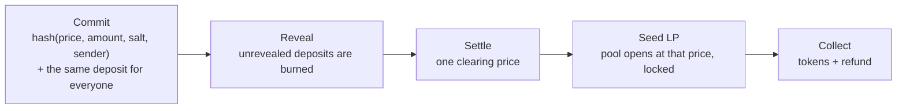

<p align="center"></p>

# Even: sealed-bid fair launches on Monad

**Nobody gets a head start.** Even launches a token through a sealed-bid auction: everyone bids blind, every winner pays the same clearing price, and the Uniswap pool opens at that price with its liquidity locked. A sniper bot can still take part; it just pays what everyone pays.

- **Live app:** https://even-monad.vercel.app
- **Demo video:** TODO: link once recorded (3 minutes max)
- **Contracts on Monad mainnet:** `AuctionEngine` [`0x0Fa0…2120`](https://monadscan.com/address/0x0Fa0E7Db5b2c2146D77E41579030A842492E2120), `TokenFactory` [`0x41F9…5DbF`](https://monadscan.com/address/0x41F968CcA0a95d4289D356c24668b1c72e645DbF), `UniswapV3Adapter` [`0x71da…72Ba`](https://monadscan.com/address/0x71da6a936f1196881C236c62a084ddEB448772Ba) ([details](SUBMISSION.md#deployment))
- **How it differs from Zama, Uniswap CCA and bonding curves:** [COMPARISON.md](COMPARISON.md)
- **Write-up for judges:** [SUBMISSION.md](SUBMISSION.md) · every PRD promise checked against code and tests: [PRD-CONFORMANCE.md](PRD-CONFORMANCE.md)

## The problem and who it is for

On a bonding curve the price rises with every buy, so arrival order decides who pays what, and bots that buy in the first blocks win. Over 500 simulated launches on the real contracts, the bot took a median 59% of the supply on a curve and 18% on Even, and 60% of buyers willing to pay the fair price got nothing on the curve versus 0% on Even ([numbers and method](SUBMISSION.md#across-500-random-launches)). Even is for communities launching their own token and for the people who want to buy into it at a fair price.

## How it works



Creators launch in three steps (token, sale, pool) and one button; bidders choose "spend up to" and "highest price" and bid in one press. Sign in with a browser wallet or a passkey (Face ID / Touch ID). Details: [SUBMISSION.md](SUBMISSION.md#how-it-works), architecture: [03-architecture.md](03-architecture.md).

## How it uses Monad

- **Fast, cheap blocks make a two-step auction practical.** A full bid (commit, reveal, claim) costs about a tenth of a cent on Monad mainnet (worst case $0.0014, [measured](SUBMISSION.md#measured-cost)), and rounds can run for minutes instead of days.
- **Monad's local mempool narrows who can see a bid in flight** to the current and next few leaders; commit-reveal keeps the bid itself sealed ([threat model](03-architecture.md)).
- **Monad-native infrastructure:** pools are seeded on Uniswap v3 on Monad and locked with the GoPlus `UniV3LPLocker` on Monad, both verified on-chain and tested against a Monad mainnet fork (19 tests). Passkey accounts use Mera from Category Labs.
- **Deployment:** Monad mainnet (chain 143); addresses above once deployed.

## Run it locally

Requirements: [Foundry](https://getfoundry.sh) (forge, anvil, cast), Node 20+, Python 3 (any static file server works).

```bash
anvil --order fifo
```

```bash
cd contracts && forge script script/DeployLocal.s.sol --rpc-url http://127.0.0.1:8545 --broadcast
```

```bash
python3 -m http.server 8765
```

Open http://127.0.0.1:8765/web/?devwallet=1 (the `devwallet` parameter, local only, gives the page an anvil test account so no extension is needed). Launch a token from "Launch a token", bid from another account (`?devwallet=2`), and move time forward with `cast rpc evm_increaseTime 660 --rpc-url http://127.0.0.1:8545` followed by `cast rpc evm_mine --rpc-url http://127.0.0.1:8545`.

For a screen recording, `demo/record-round.sh` does all of the above in one command: it starts anvil and the web server, opens a Degen round with four sealed bids from anvil accounts 3–6, then at each Enter moves the clock to the next stage and prints the `?devwallet=` and `?passkeytest=` URLs to open (`NOWAIT=1` runs it straight through).

Replays: `demo/run.sh` (bot vs crowd on a bonding curve and on Even), `demo/exit/run.sh` (vault exit auction), `demo/exit/run-institutional.sh` (a permissioned vault's sealed exit round against a FIFO queue; see [Second market: institutional vault exits](SUBMISSION.md#second-market-institutional-vault-exits) and https://even-monad.vercel.app/exit#institutional), `cd demo && LAUNCHES=500 forge script script/FairnessStats.s.sol && node tools/fairness-summary.mjs` (fairness statistics).

## Tests

```bash
cd contracts && forge test
```

102 contract tests (unit, fuzz at 512 runs; `FOUNDRY_PROFILE=deep` for 10,000), plus 19 against a Monad mainnet fork (`forge test --match-path "test/fork/*" --fork-url https://rpc1.monad.xyz`). Web: `node web/selftest.mjs`, `node web/e2e.mjs` (starts its own anvil), `node web/tools/simple.test.mjs`, `node web/tools/reminder.test.mjs`. Indexer: `cd indexer && npm test`. Demo: `cd demo && forge test`.

## Deploy to Monad

Deploy scripts use a Foundry keystore (`--account`), so no key sits in the shell; steps and the post-deploy checklist are in [SUBMISSION.md](SUBMISSION.md#deployment).

## Repository layout

| Path | What |
| --- | --- |
| `contracts/` | Foundry project: `SealingLayer` (commit/reveal), `DepositLedger`, `UniformClearing`, `AuctionEngine`, `adapters/UniswapV3Adapter`, `launch/TokenFactory`, `exit/` (vault exit auction), tests and deploy scripts |
| `web/` | The Even app: static HTML, CSS and ES modules, no build step |
| `indexer/` | Node event indexer and read-only JSON API; fee report |
| `demo/` | Head-to-head replay, fairness simulation, vault exit demo page |
| `tasks/`, `*.md` | Spec, decisions, audits and implementation briefs |

## Tech stack

Solidity 0.8.28 with Foundry; plain JavaScript (ES modules) and CSS for the web app, served statically (Vercel); Node for the indexer. Full table: [07-tech-stack.md](07-tech-stack.md).

## Security

[SECURITY.md](SECURITY.md) has the threat model (the PRD's eight money-path bug classes) and every result with numbers: two internal reviews with a proof-of-concept test per finding ([AUDIT.md](AUDIT.md)) and an independent review of v2; 151 unit, fuzz and invariant tests, also under Monad's execution rules, with the invariants run at 128,000 random calls; a 1,000-bidder scale test; mainnet-fork tests against Uniswap v3 and the GoPlus locker; mutation testing of the money path (90.3% of 1,581 mutants killed, every survivor classified as equivalent or unreachable); symbolic proofs of the clearing and payment propositions within stated bounds ([contracts/PROPERTIES.md](contracts/PROPERTIES.md)); Slither, Aderyn, `forge lint` and AgentGuard, triaged in [contracts/STATIC-ANALYSIS.md](contracts/STATIC-ANALYSIS.md) and [SUBMISSION.md](SUBMISSION.md#security-scan-agentguard). The contracts have not had an external audit.

## Built during the hackathon, AI disclosure and attribution

- **Build window.** Everything in this repository was written from 22 Sep 2026 onwards, inside the hackathon period; the commit history shows it. An early plan to fork Gnosis EasyAuction was dropped: its clearing was rewritten from scratch (decision 22) and the reference copy was removed, so no EasyAuction code remains.
- **AI coding tools.** This project was built with AI coding tools, as the rules allow: Claude Code (Anthropic) wrote most of the code, tests and documentation under the author's direction, and other AI coding agents (run in parallel through the herdr multiplexer) produced early drafts on 22–23 Sep that were later reviewed and largely rewritten. Every contract is covered by the tests and reviews above.
- **Third-party code, unmodified:** OpenZeppelin Contracts v5.1.0 (MIT) in `contracts/src/vendor/openzeppelin/`, used by the token factory and the demo vault; forge-std (MIT/Apache-2.0) in `contracts/lib/`; js-sha3 (MIT) in `web/vendor/`.
- **Loaded at runtime:** Mera 0.2.0 by Category Labs (Apache-2.0/MIT), viem (MIT) and @scure/bip32, @scure/bip39 (MIT), from jsDelivr when a visitor picks a passkey; fonts Jersey 10, Schibsted Grotesk and Silkscreen from Google Fonts (SIL OFL).
- **Algorithms re-implemented, not copied:** 512-bit `mulDiv` after Remco Bloemen (MIT), integer square root after ABDK (BSD-4), the sqrt-price bounds of Uniswap v3 `TickMath` (`contracts/src/adapters/UniV3PriceMath.sol`). Uniform-price clearing with pro-rata at the clearing price follows the mechanism described by Zama's auction docs.
- **Integrations:** Uniswap v3 and GoPlus SafeToken Locker contracts on Monad are called, not included.

## License

MIT, see [LICENSE](LICENSE). Vendored and runtime libraries keep their own licenses, listed above.

## Documentation index

| File | What it contains |
| --- | --- |
| [01-overview.md](01-overview.md) | The product in one sentence, what it does, and what the demo shows. |
| [02-problem.md](02-problem.md) | The FIFO allocation problem, who has it, existing solutions (Monad and Arbitrum), and our edge. |
| [03-architecture.md](03-architecture.md) | Components, how they connect, architecture diagram, external services, Arbitrum portability. |
| [04-flows.md](04-flows.md) | Bidder, creator, clearing, exit-auction and demo flows, each with a sequence diagram and failure cases. |
| [05-data-model.md](05-data-model.md) | Entities (Auction, Commitment, Bid, Deposit, Fill, LP seed) with fields and relations. |
| [06-api.md](06-api.md) | The engine's implemented contract interface, views and events, and the indexer's HTTP API. |
| [07-tech-stack.md](07-tech-stack.md) | Layer-by-layer choices, why, and the alternative passed on. |
| [08-ui-notes.md](08-ui-notes.md) | Screen-by-screen notes for creator, bidder and demo dashboards, each pointing to the file that builds it. |
| [09-resources.md](09-resources.md) | All links grouped by category. |
| [10-decisions.md](10-decisions.md) | Decisions in decision / rationale / trade-off format. |
| [11-roadmap.md](11-roadmap.md) | Task table in time blocks from 22 Sep to 13 Oct with priority and demo-required flag. |
| [12-open-questions.md](12-open-questions.md) | Unanswered questions, source contradictions, risks, assumptions. |

Also at the root: [DESIGN.md](DESIGN.md) (Even's design system), [PRODUCT.md](PRODUCT.md) (product record for design work), [AGENTS.md](AGENTS.md) (agent brief), [AUDIT.md](AUDIT.md) (two internal reviews and their fixes).

Related files: all of the above.
