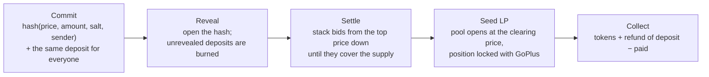

# Even — sealed-bid fair launches on Monad

**The problem:** on a bonding curve, arrival order sets the price, so bots buy the first blocks and the community buys the top.

**The result**, from our replayed head-to-head (same token, same 13 players, 73 real transactions against the real contracts on a local chain) [src: demo/results.json]:

| | Bonding curve | Even |
| --- | --- | --- |
| Bot's average price | 0.138 MON | 0.220 MON |
| Crowd's average price | 0.275 MON | 0.220 MON |
| Bot's share of supply | 54.5% (blocks 1–3) | 25% |
| Players who got nothing | 8 of 12 | 1 of 12 (bid below the clearing price, refunded in full) |

**Who it is for:** memecoin communities on Monad that want their launch to go to their own buyers, and the creators who launch for them [src: PRODUCT.md].

**Live:** https://even-monad.vercel.app (the pitch, the replay and the app; the engine is not on a public network yet, see [Deployment](#deployment)). Code: this repository.

---

The judge-facing write-up for the Monad Metropolis submission (Social, Attention & Culture track). Mechanism, evidence, cost and limits follow.

Status: draft

## In one line

Your community shouldn't lose its own launch to three bots in the first block. On Even everyone bids sealed, every winner pays the same clearing price, and the pool opens at that price with its liquidity locked [src: 01-overview.md].

Snipe-resistant: submission timing no longer determines price. The bot still takes part; it just pays what everyone pays.

### Across 500 random launches

The same comparison, repeated on 500 random launches: 8–24 buyers each with a random budget (8–40 MON) and price limit (0.15–0.60 MON per token), and one sniper bot (40–120 MON). Every launch is played twice with the same people. On the curve the bot buys in the first three blocks and buyers arrive in random order, each buying while the price is under their limit. On Even everyone bids sealed, the bot at a high price, on the real `AuctionEngine` [src: demo/script/FairnessStats.s.sol, demo/fairness.json].

| Over 500 launches | Bonding curve | Even |
| --- | --- | --- |
| Bot's share of the supply (median, p10–p90) | 59% (39–72%) | 18% (11–26%) |
| Buyers willing to pay the fair price who got nothing | 60% | 0% |
| Launches where the last third to arrive got nothing | 80% | 0% |
| Highest ÷ lowest price paid by buyers (median, p10–p90) | 1.79× (1.46–2.32×) | 1× (every winner pays the clearing price, to 121 wei of rounding) |
| Launches where the bot paid less than the crowd | 100% | 0% |

On this curve the crowd's average price is exactly twice the bot's whenever the curve sells out (a property of its constant-product shape and sale size: 1.74–2.00× across the runs), so that ratio is not reported as a finding. Reproduce: `cd demo && LAUNCHES=500 forge script script/FairnessStats.s.sol && node tools/fairness-summary.mjs`.

How Even differs from Zama's auction, Uniswap CCA, bonding curves and other launch mechanisms, with likely judge questions answered: [COMPARISON.md](COMPARISON.md).

## How it works



- **Commit.** `keccak256(abi.encode(price, amount, salt, msg.sender))` plus a uniform deposit. The deposit does not scale with the bid, so it leaks nothing about it [src: contracts/src/SealingLayer.sol].
- **Reveal.** A bid that is not revealed loses its deposit, burned to `0x…dEaD` in one O(1) call (decision 30).
- **Clear.** The price where cumulative demand first covers the supply is the clearing price. Bids above it fill in full, bids at it share the rest pro-rata (rounding down), and every winner pays the clearing price (rounding up); the overpayment is refunded [src: contracts/src/UniformClearing.sol, tasks/clearing.md]. Settlement is resumable across transactions, so a large book cannot be gas-bricked, and a mandatory minimum bid stops dust spam.
- **Seed LP.** A share of tokens sold and MON raised seeds Uniswap v3 at exactly the clearing price, before any auctioned token leaves the contract, so there is nothing to sandwich (bug #7, decision 27). The position NFT is locked in GoPlus `UniV3LPLocker`: permanently on the Degen preset, for a creator-chosen period on Raise. The creator collects trading fees.
- **Presets.** Degen (minutes, open, permanent lock, unsold supply burned) and Raise (allowlist, vesting, unsold supply returned). A creator can bring a token or make one on the spot with the token factory. A second product, the vault **exit-priority auction**, runs on the same clearing to replace FIFO redemption queues [src: contracts/src/exit/].

## What we built in the window

| Part | Where | Evidence |
| --- | --- | --- |
| Engine: sealing, deposit ledger, clearing, LP seeding, presets | `contracts/src/` | 102 contract tests pass, each run once, including 11 that check the PRD's promises one by one ([PRD-CONFORMANCE.md](PRD-CONFORMANCE.md)); the fuzz tests also run clean at 10,000 runs each (`FOUNDRY_PROFILE=deep`) |
| Uniswap v3 adapter + GoPlus lock | `contracts/src/adapters/` | 19 tests against real Uniswap v3 and the GoPlus locker on a Monad mainnet fork |
| Exit-priority auction + demo vault | `contracts/src/exit/`, `demo/exit/` | 29 of the 102 tests (exit auction, allowlist and vault); replayed vault-run demo page |
| Passkey sign-in | `web/js/passkey-wallet.js` | Face ID / Touch ID makes a standard Monad account with Mera (Category Labs): no extension, works on phones, phrase exportable to MetaMask. A full round (create token, open, commit, recover the bid from its note, reveal, settle, seed, claim) ran with a passkey-derived account on a local chain; there the Face ID step was replaced by a fixed test seed, so the passkey ceremony itself still needs a real-device test |
| Token factory | `contracts/src/launch/` | Make a fixed-supply token (no owner, no mint, no fees) and launch it from the same page, as on a launchpad; 4 tests, plus an end-to-end launch |
| Web app "Even" | `web/` | Launch in three steps and one button (token, sale, pool), bid with "spend up to" and "highest price" in one press; create token → commit → reveal → settle → seed → claim run end to end through the UI on a local chain; reveal reminders (calendar file, notification) and a shareable result card; 119 self-tests, 94 end-to-end tests and a 54,571-case grid test of the simple launch and bid forms |
| Indexer + fee report | `indexer/` | Decodes all 13 events, read-only JSON API |
| Head-to-head demo | `demo/` | 73 transactions against the real engine |
| Security | [AUDIT.md](AUDIT.md) | Two internal reviews, each finding with a proof-of-concept test, all fixed or documented; AgentGuard scan below |

## Second market: institutional vault exits

On 6 Oct 2026 Category Labs published Monad Private Settlement: a design, not live yet, for institutions to run private execution and settlement domains on Monad [src: https://monad.xyz/blog/monad-private-settlement]. The need behind it, moving size without showing your hand, is one Even's exit auction already meets for a vault, with commit-reveal. When a vault's liquid buffer is smaller than redemption demand, holders bid a sealed discount to exit now, everyone who exits pays one clearing discount, and the discount stays in the vault for the holders who stay. `ExitAuction` takes an allowlist root, which fits a permissioned vault (a credit or treasury vault with whitelisted LPs).

**The scenario.** "Treasury Yield Vault", nine allowlisted LPs (a Merkle root of their addresses), one sealed round on the real `ExitAuction` + `DemoVault` on a local chain. Seven LPs want 530,000 WMON out; the idle buffer holds 185,000 (35%). Bids are scenario inputs we chose; every auction number is read from chain after the claims. The FIFO column is a model over the same buffer: requests paid at par in arrival order, with the two fastest desks getting in ahead of the fund's visible request [src: demo/exit/institutional.json, demo/script/InstitutionalExit.s.sol]. Page: https://even-monad.vercel.app/exit#institutional.

| | FIFO queue (model) | Sealed exit round (on-chain) |
| --- | --- | --- |
| Who gets the 185,000 WMON | The first two to arrive: Desk D, then Desk B, both ahead of Fund A's request | The four highest discounts: LP E, Desk D, LP G in full, Fund A pro-rata at the margin |
| Cost of exiting now | Par | 0.75% for every exit, the lowest winning bid |
| LPs who wanted out and got nothing | 5 of 7, including Fund A and all three small LPs | 3 of 7, each having bid below 0.75%; their shares came back |
| Paid to the LPs who stay | 0 | 1,387.5 WMON, to every share still in the vault |
| Exit size visible before the close | Yes, the queue is public | No: each commit is a hash plus the same 1 MON deposit |

| LP | Wants out (WMON) | FIFO: paid now | Sealed bid | Auction: paid now | Exit cost | Accrued on shares kept |
| --- | ---: | ---: | ---: | ---: | ---: | ---: |
| Fund A (large fund) | 250,000 | 0 | 0.75% | 92,302.5 (93k of 250k filled) | 697.5 | +595.8 |
| Desk B | 120,000 | 110,000 | 0.50% | 0, shares back | — | +232.9 |
| Desk C | 60,000 | 0 | 0.40% | 0, shares back | — | +174.7 |
| Desk D | 75,000 | 75,000 | 1.20% | 74,437.5 | 562.5 | — |
| LP E | 12,000 | 0 | 1.50% | 11,910.0 | 90.0 | — |
| LP F | 8,000 | 0 | 0.25% | 0, shares back | — | +15.5 |
| LP G | 5,000 | 0 | 1.00% | 4,962.5 | 37.5 | — |
| Desk H, LP I (staying) | — | — | — | — | — | +291.1, +77.6 |

Exit cost is the exited shares' value at settlement minus the WMON paid; the 1,387.5 WMON it adds up to is exactly what the shares left in the vault gained. Every 1 MON deposit came back in full; the auction holds no shares, WMON or MON after the claims.

- **Sealed until the close.** During the commit window the chain shows a hash and one uniform deposit per bid, so Fund A's 250,000 WMON exit looks the same as LP G's 5,000; no desk can see another desk's exit size or price before bidding closes. What is public: how many bids and when. Bids open in the reveal window and stay public after the round, by design. Privacy via commit-reveal; snipe-resistant: submission timing no longer determines price.
- **Allowlist = only the vault's LPs can bid.** In the run, an outside address's commit reverted with "not on allowlist", also when it reused Fund A's valid proof (a proof is bound to its address). The allowlist checks addresses; it is not identity verification, and KYC stays a non-goal.
- **Settles on Monad.** Commit, reveal, settle and claim are ordinary transactions to `ExitAuction`; exits are paid in WMON from the vault's idle buffer.
- **Private Settlement.** Monad's Private Settlement design would let institutions run this inside a private domain. Even does it today with commit-reveal: the same sealing that is live on Monad mainnet in Even's launch engine, with bids public after the round. Even does not use or integrate Private Settlement. The exit vault itself is not deployed on mainnet yet; its deploy script is ready (`contracts/script/DeployExitMainnet.s.sol`).
- **Mainnet path, not deployed.** `contracts/script/DeployExitMainnet.s.sol` deploys `DemoVault` over real WMON (`0x3bd359C1119dA7Da1D913D1C4D2B7c461115433A`) and an `ExitAuction` with a required allowlist root, as a reference vault with a simulated strategy (its "strategy" is a mark on WMON that never leaves the vault). Simulated on a Monad mainnet fork on 9 Oct 2026, no broadcast: three transactions, 5,492,197 gas, which is about 0.56 MON at the then base fee of 100 gwei plus 2 gwei tip (forge's upper bound at a 202 gwei max fee: 1.11 MON).
- **Limits.** One round, one scenario, with bids we set; the FIFO side is a model, not a contract; the vault's strategy is simulated (decision 31). Reproduce: `demo/exit/run-institutional.sh`.

## Measured cost

The whole bidder journey costs about a tenth of a cent. Gas from `contracts/script/FeeProbe.s.sol`, priced by `indexer/fee-report.mjs` at Monad mainnet's live gas price (102 gwei, `eth_gasPrice` on rpc.monad.xyz) and MON = $0.0252 (CoinGecko), 24 Sep 2026:

| Journey | Gas | Cost |
| --- | --- | --- |
| Win pro-rata: commit + reveal + claim | 442,934 | $0.0011 |
| Lose, refund only | 389,072 | $0.0010 |
| Worst complete journey (new top price level, refund and tokens claimed separately) | 558,301 | $0.0014 |

Target was under $0.01; the worst case is 7× below it. Monad charges the gas limit, so these use the gas a wallet must send, not the gas used.

## Honest limits

- **Privacy via commit-reveal.** There is no encrypted mempool on Monad today, so none is used. What stays public: the number of bids and when they arrived, the uniform deposit (which caps bid size), the price tick, and every bid once the round settles; that post-clear transparency is intentional. The round page's demand meter uses only these public numbers (bids × the uniform deposit, against the whole sale at the floor price) and labels the result an upper bound [src: web/js/demand.js].
- **The adversary is narrower than usual.** Monad forwards transactions only to the next few leaders, so the threat is the current and next few leaders, not every bot on the network [src: 03-architecture.md].
- **Last reveal is a position.** A bidder who reveals last sees the book first. Revealing late cannot change a committed bid, only whether to reveal it, and not revealing costs the deposit.
- **Passkey libraries load at runtime.** Mera, viem and scure come from jsDelivr at pinned versions when a visitor picks a passkey; jsDelivr's on-the-fly builds cannot carry an integrity hash, so a compromised CDN could read keys in that session. Serving them from the site itself removes this; not done yet. Passkey accounts also belong to the site's hostname: a different domain derives a different account (the exported phrase moves funds anywhere).
- **Two transactions against one click.** Memecoin buyers want one click, and LBPs show fairer launches alone do not win users. Our answer: the Degen preset runs in minutes, the bidder journey costs a tenth of a cent, and when Monad's BTX encrypted-mempool research ships, commit-reveal collapses into a single transaction without changing the clearing. The sealing layer is a separate module for exactly that swap (decision 12).

## Security scan (AgentGuard)

`agentguard scan contracts/src`, AgentGuard CLI 1.1.28, 24 Sep 2026: 4 findings, triaged below. The CLI reports only tags, so each file was scanned on its own to locate them. Its suppression file (`contracts/src/.agentguard-suppress.yaml`) is not read by this CLI version.

| Tag | File | Verdict |
| --- | --- | --- |
| HIDDEN_TRANSFER | `lib/SafeTransferLib.sol` (`sendValue`) | Intended. The single native-MON send on the money path (refunds, burns, creator proceeds), behind the reentrancy lock and per-round accounting. Reviewed twice in [AUDIT.md](AUDIT.md). |
| HIDDEN_TRANSFER | `vendor/openzeppelin/utils/Address.sol` | Vendored OpenZeppelin v5.1.0, unmodified; used by the demo vault only. |
| WALLET_DRAINING | `vendor/openzeppelin/token/ERC20/IERC20.sol` | Interface declaration of `approve`/`transferFrom`; no code. |
| WALLET_DRAINING | `vendor/openzeppelin/interfaces/IERC1363.sol` | Interface declaration; no code. |

Bidders never approve anything: bids are paid in native MON. The creator approves the sale tokens once, for `openRound`. The engine's own approvals are exact-amount and short-lived, all inside `seedLP`: the adapter pulls the LP tokens (reset to zero after), and the GoPlus locker takes the position NFT.

## Run it

```bash
anvil --order fifo
cd contracts && forge script script/DeployLocal.s.sol --rpc-url http://127.0.0.1:8545 --broadcast
cd .. && python3 -m http.server 8765
```

Open http://127.0.0.1:8765/web/. Replay the head-to-head with `demo/run.sh`; the vault demo with `demo/exit/run.sh`. Tests: `cd contracts && forge test`, `node web/selftest.mjs`, `node web/e2e.mjs`.

## Deployment

Live on **Monad mainnet** (chain 143) since 6 Oct 2026, block 110869168 onwards:

| Contract | Address | Deploy tx |
| --- | --- | --- |
| `AuctionEngine` | [`0x0Fa0E7Db5b2c2146D77E41579030A842492E2120`](https://monadscan.com/address/0x0Fa0E7Db5b2c2146D77E41579030A842492E2120) | [`0xd116…f304`](https://monadscan.com/tx/0xd116b9bc4d7b015cccb854a67e97c46074d1277699207c22f202d806d0a2f304) |
| `TokenFactory` | [`0x41F968CcA0a95d4289D356c24668b1c72e645DbF`](https://monadscan.com/address/0x41F968CcA0a95d4289D356c24668b1c72e645DbF) | [`0x23f0…93c9`](https://monadscan.com/tx/0x23f00fad0cb7d5cd46c0b7ede0f9a09ef8b139328a2e4a0fd4dee81daf5a93c9) |
| `UniswapV3Adapter` | [`0x71da6a936f1196881C236c62a084ddEB448772Ba`](https://monadscan.com/address/0x71da6a936f1196881C236c62a084ddEB448772Ba) | [`0x2df9…f2b7`](https://monadscan.com/tx/0x2df9ff331dd5a88bbb6dcbabf272ef9413c2ed060de585832a4397f5ad3df2b7) |

The engine uses the existing Monad deployments of Uniswap v3 (factory `0x204FAca1764B154221e35c0d20aBb3c525710498`, position manager `0x7197E214c0b767cFB76Fb734ab638E2c192F4E53`), WMON (`0x3bd359C1119dA7Da1D913D1C4D2B7c461115433A`) and the GoPlus `UniV3LPLocker` (`0x24A9eB23De8E6f59BDB981B03E847F0f3ABbFa0d`). Checked on-chain after deploy: the engine allows the adapter, its locker is GoPlus, the permanent-lock end is 1 Jan 2100 and the LP grace period is one day. All three deployments cost 0.99 MON in total (9.68M gas at 102 gwei).

**First live round (6 Oct 2026):** [round 1](https://even-monad.vercel.app/web/#/round/1), run end to end on mainnet with `contracts/script/live-round.sh`: a fresh factory token ([`EVTEST`](https://monadscan.com/address/0x6e187bda0cb0f5f52fb62e2e396eb12405110e1b)), three sealed bids for 650,000 tokens against 500,000 for sale, cleared oversubscribed at 0.0000012 MON per token, everyone paid that price, the last bidder was filled pro-rata, and the pool was seeded and locked in one transaction ([seed and lock](https://monadscan.com/tx/0x2e6f24fdd035d07db463e15e82e9037b7b3ee45bd4164d0248387ba10c92f139), Uniswap v3 pool [`0xc9fc…f42A`](https://monadscan.com/address/0xc9fc46B5387Ba19D69c5Bea70EC50F04233df42A)).

To redeploy (for example to a fork or another chain), from `contracts/`, with a funded deployer imported once as a Foundry keystore (`cast wallet import deployer --interactive`), so no key sits in the shell:

```bash
forge script script/DeployAdapter.s.sol --rpc-url https://rpc.monad.xyz --account deployer --broadcast
```

```bash
ADAPTERS=<adapter address from deployments/143-adapter.json> forge script script/Deploy.s.sol --rpc-url https://rpc.monad.xyz --account deployer --broadcast
```

The engine address lands in `contracts/deployments/143.json`; put it in `web/config.js` under `monad.deployment.auctionEngine` and here.

**Alternative for a wallet that can only call contracts** (for example the OKX Agentic Wallet, which supports Monad but sends no contract-creation transaction): `forge script script/Create2Plan.s.sol --fork-url https://rpc.monad.xyz` writes three calls to the standard CREATE2 deployer (`0x4e59b44847b379578588920cA78FbF26c0B4956C`, live on Monad) and simulates them on a mainnet fork. The addresses are fixed in advance (salt `even-v1`, 5 Oct build): `UniswapV3Adapter` `0xf39aC5535BBC2d05DAB077F9bbA02fAc9003D87C`, `AuctionEngine` `0xA24b9038C1f517bc0be0FAe6374B6D7a4BC90312`, `TokenFactory` `0xD739cb0b65E48EE7443beEEA0950733C76dA4D4e`. Any code change changes them; rerun the plan before deploying.

**After deploying** (the site reads through `https://rpc2.monad.xyz`, which serves `eth_getLogs` over 10,000 blocks per call; the other public RPCs cap it at 100 blocks, about 40 seconds of Monad. The app scans the engine's history once in parallel chunks and then fetches only new blocks):

1. In `web/config.js` under `monad.deployment`, set `auctionEngine`, `adapter`, `tokenFactory` and `positionManager` (`0x7197E214c0b767cFB76Fb734ab638E2c192F4E53`).
2. Set `monad.fromBlock` to the engine's deploy block, so log scans start there.
3. Push to `master`: Vercel redeploys `https://even-monad.vercel.app` automatically.
4. Open one small real round from the Host page, bid from two wallets, and settle, seed and claim it; put its round link here.

## Demo video (script, about 2 minutes)

1. **0:00–0:20 — the replay.** Landing page: the two-player cabinet plays. The bot wins the curve; Even calls a draw at 0.220. No narration beyond the captions.
2. **0:20–0:40 — the claim.** "Nobody gets a head start. Snipe-resistant: submission timing no longer determines price."
3. **0:40–1:20 — a bid.** Round page: insert coin (commit), the coin rack fills, the clock runs out, continue? (reveal), settle, results with the demand staircase and the one price.
4. **1:20–1:40 — the pool.** Seed LP, show the locked position and the refund landing.
5. **1:40–2:00 — the proof.** Tests, fork tests, fee table ($0.0014 worst case), and the honest-limits list.

Related files: [README.md](README.md) · [01-overview.md](01-overview.md) · [03-architecture.md](03-architecture.md) · [AUDIT.md](AUDIT.md) · [DESIGN.md](DESIGN.md) · [10-decisions.md](10-decisions.md)
